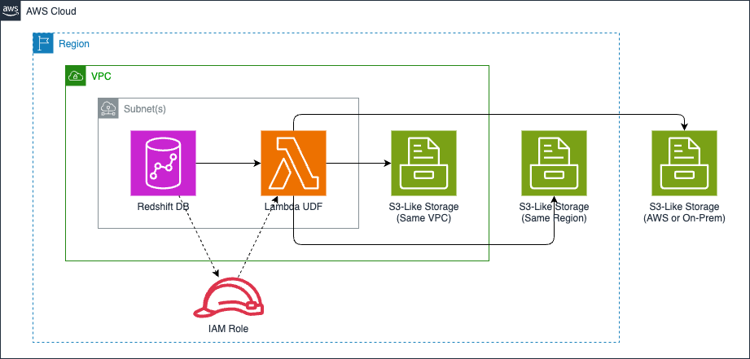

<!-- BEGIN_TF_DOCS -->
# Terraform Module for Amazon Redshift Copy UDF

This terraform module provides complimentary capabilities to
[COPY command](https://docs.aws.amazon.com/redshift/latest/dg/r_COPY.html)
by enabling data copy from S3 API compliant storage solutions such as
[Cloudian](https://github.com/cloudian/cloudian-s3-operator),
[MinIO](https://github.com/minio/minio), and
[Weka](https://github.com/weka/csi-wekafs) into Amazon Redshift with
AWS Lambda UDF (User Defined Function).

## Architecture Diagram



## Usage

```terraform
module "udf" {
  source  = "aws-ia/redshift-copy-udf/aws"
  version = "~> 1.0"

  name        = "redshift-copy-udf"
  memory_size = 128
  timeout     = 5

  vpc_subnet_ids     = null # replace with comma separated values
  security_group_ids = null # replace with comma separated values
}
```

## Requirements

| Name | Version |
|------|---------|
| <a name="requirement_terraform"></a> [terraform](#requirement\_terraform) | >= 1.0.0 |
| <a name="requirement_aws"></a> [aws](#requirement\_aws) | >= 4.0.0 |

## Providers

| Name | Version |
|------|---------|
| <a name="provider_aws"></a> [aws](#provider\_aws) | >= 4.0.0 |

## Modules

| Name | Source | Version |
|------|--------|---------|
| <a name="module_lambda"></a> [lambda](#module\_lambda) | terraform-aws-modules/lambda/aws | ~> 7.0 |

## Resources

| Name | Type |
|------|------|
| [aws_iam_role.redshift](https://registry.terraform.io/providers/hashicorp/aws/latest/docs/resources/iam_role) | resource |
| [aws_iam_role_policy.redshift](https://registry.terraform.io/providers/hashicorp/aws/latest/docs/resources/iam_role_policy) | resource |
| [aws_caller_identity.this](https://registry.terraform.io/providers/hashicorp/aws/latest/docs/data-sources/caller_identity) | data source |
| [aws_partition.this](https://registry.terraform.io/providers/hashicorp/aws/latest/docs/data-sources/partition) | data source |
| [aws_region.this](https://registry.terraform.io/providers/hashicorp/aws/latest/docs/data-sources/region) | data source |
| [aws_secretsmanager_secret.this](https://registry.terraform.io/providers/hashicorp/aws/latest/docs/data-sources/secretsmanager_secret) | data source |
| [aws_secretsmanager_secret_version.this](https://registry.terraform.io/providers/hashicorp/aws/latest/docs/data-sources/secretsmanager_secret_version) | data source |

## Inputs

| Name | Description | Type | Default | Required |
|------|-------------|------|---------|:--------:|
| <a name="input_memory_size"></a> [memory\_size](#input\_memory\_size) | Lambda UDF memory size | `number` | `128` | no |
| <a name="input_name"></a> [name](#input\_name) | Lambda UDF function name | `string` | `"redshift-copy-udf"` | no |
| <a name="input_security_group_ids"></a> [security\_group\_ids](#input\_security\_group\_ids) | Security Group IDs (comma separated values) | `string` | `null` | no |
| <a name="input_storage_pass"></a> [storage\_pass](#input\_storage\_pass) | Storage Password to Access S3 API Compliant Storage | `string` | `null` | no |
| <a name="input_storage_secret_arn"></a> [storage\_secret\_arn](#input\_storage\_secret\_arn) | Secrets Manager ARN for S3 API Compliant Storage Credentials | `string` | `null` | no |
| <a name="input_storage_url"></a> [storage\_url](#input\_storage\_url) | Storage URL to Access S3 API Compliant Storage | `string` | `null` | no |
| <a name="input_storage_user"></a> [storage\_user](#input\_storage\_user) | Storage Username to Access S3 API Compliant Storage | `string` | `null` | no |
| <a name="input_timeout"></a> [timeout](#input\_timeout) | Lambda UDF timeout | `number` | `300` | no |
| <a name="input_vpc_subnet_ids"></a> [vpc\_subnet\_ids](#input\_vpc\_subnet\_ids) | VPC Subnet IDs (comma separated values) | `string` | `null` | no |

## Outputs

| Name | Description |
|------|-------------|
| <a name="output_iam_role_arn"></a> [iam\_role\_arn](#output\_iam\_role\_arn) | IAM Role ARN for Redshift Permissions |
| <a name="output_iam_role_id"></a> [iam\_role\_id](#output\_iam\_role\_id) | IAM Role ID for Redshift Permissions |
| <a name="output_iam_role_name"></a> [iam\_role\_name](#output\_iam\_role\_name) | IAM Role Name for Redshift Permissions |
| <a name="output_lambda_function_arn"></a> [lambda\_function\_arn](#output\_lambda\_function\_arn) | Lambda Function ARN for Redshift UDF |
| <a name="output_lambda_function_name"></a> [lambda\_function\_name](#output\_lambda\_function\_name) | Lambda Function Name for Redshift UDF |
<!-- END_TF_DOCS -->