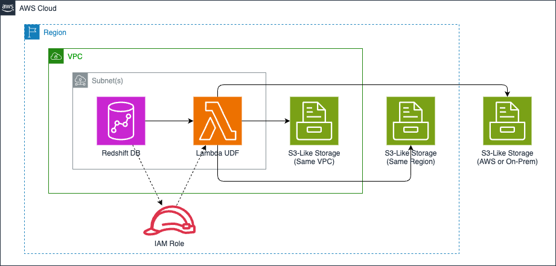

<!-- BEGIN_TF_DOCS -->
# Basic Example

This terraform module provides complimentary capabilities to
[COPY command](https://docs.aws.amazon.com/redshift/latest/dg/r_COPY.html)
by enabling data copy from S3 API compliant storage solutions such as
[Cloudian](https://github.com/cloudian/cloudian-s3-operator),
[MinIO](https://github.com/minio/minio), and
[Weka](https://github.com/weka/csi-wekafs) into Amazon Redshift with
AWS Lambda UDF (User Defined Function).

## Architecture Diagram



## Usage

* Initialize terraform configs and modules

```sh
terraform init
```

* Review the resources to be created by terraform

```sh
terraform plan
```

* Apply the changes reviewed in the previous step

```sh
terraform apply
```

* When you need to clean up resources

```sh
terraform destroy
```

## Requirements

| Name | Version |
|------|---------|
| <a name="requirement_terraform"></a> [terraform](#requirement\_terraform) | >= 1.0.0 |
| <a name="requirement_aws"></a> [aws](#requirement\_aws) | >= 4.0.0 |

## Providers

| Name | Version |
|------|---------|
| <a name="provider_aws"></a> [aws](#provider\_aws) | >= 4.0.0 |

## Modules

| Name | Source | Version |
|------|--------|---------|
| <a name="module_udf"></a> [udf](#module\_udf) | ../../ | n/a |

## Resources

| Name | Type |
|------|------|
| [aws_availability_zones.this](https://registry.terraform.io/providers/hashicorp/aws/latest/docs/data-sources/availability_zones) | data source |
| [aws_caller_identity.this](https://registry.terraform.io/providers/hashicorp/aws/latest/docs/data-sources/caller_identity) | data source |
| [aws_partition.this](https://registry.terraform.io/providers/hashicorp/aws/latest/docs/data-sources/partition) | data source |
| [aws_region.this](https://registry.terraform.io/providers/hashicorp/aws/latest/docs/data-sources/region) | data source |

## Inputs

No inputs.

## Outputs

| Name | Description |
|------|-------------|
| <a name="output_iam_role_arn"></a> [iam\_role\_arn](#output\_iam\_role\_arn) | IAM Role ARN for Redshift Permissions |
| <a name="output_iam_role_id"></a> [iam\_role\_id](#output\_iam\_role\_id) | IAM Role ID for Redshift Permissions |
| <a name="output_iam_role_name"></a> [iam\_role\_name](#output\_iam\_role\_name) | IAM Role Name for Redshift Permissions |
| <a name="output_lambda_function_arn"></a> [lambda\_function\_arn](#output\_lambda\_function\_arn) | Lambda Function ARN for Redshift UDF |
| <a name="output_lambda_function_name"></a> [lambda\_function\_name](#output\_lambda\_function\_name) | Lambda Function Name for Redshift UDF |
<!-- END_TF_DOCS -->